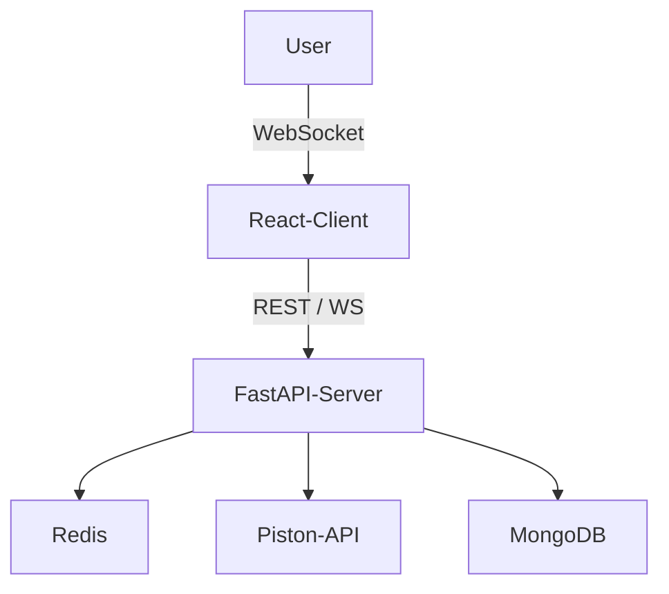

# 🚀 TechCafe

Welcome to **TechCafe** — a real-time, domain-based coding battle platform where developers hang out, solve DSA/debugging challenges, and level up together. Built with ❤️ to bring the thrill of live problem-solving into one seamless experience.

---

## 🧠 Features

- 🔥 Real-time matchmaking for Coding & Debugging battles
- 📺 Camera-enabled battle rooms (WebRTC)
- 🧮 DSA & Debug challenges with sample + hidden test cases
- ✍️ Collaborative code editor (CodeMirror)
- ⚔️ Battle rounds with 3 questions, 15-minute timer
- 🎯 Auto reshuffle or restart after each round
- 🧵 Queue management with Redis
- ⚙️ Code execution using Piston API (multi-language)
- 🚀 FastAPI backend, React frontend

---

## 🏗️ Architecture Overview



---

## 🛠️ Tech Stack

| Frontend        | Backend    | Realtime              | Infra / Others         |
| --------------- | ---------- | --------------------- | ---------------------- |
| React, Tailwind | FastAPI    | WebSocket (WS), Redis | Docker, Render, Vercel |
| CodeMirror      | Piston API | RabbitMQ (planned)    | GitHub Actions (CI/CD) |

---

## 🔄 Matchmaking Logic

1. User selects a domain (e.g., DSA)
2. Enters a Redis queue
3. When 4 users join → a battle room is formed
4. Randomly assigns Coding or Debugging challenge
5. Users get 3 questions + timer + camera access
6. Winner: solves all questions / finishes fastest

---

## 🧪 Code Evaluation Flow

1. User writes solution in the editor
2. Hits Run → Validates visible test cases
3. Hits Submit → Full code (user method + hidden boilerplate) sent to backend
4. Backend merges + executes via Piston API
5. Validates against all 10 test cases (8 hidden)

---

## 🚀 Getting Started (Dev)

Visit the backend repository - [TechCafe Backend](https://github.com/parthhalwane/techcafe-backend)

```bash
# Clone the repo
git clone https://github.com/parthhalwane/TechCafe.git
cd TechCafe

# Start frontend (React)
cd frontend
npm install
npm run dev

# Clone the repo
git clone https://github.com/parthhalwane/TechCafe-backend.git
cd TechCafe-backend

# Start backend (FastAPI)
cd backend
pip install -r requirements.txt
uvicorn fastapi_app/app.main:app --reload
```

## ⚙️ Environment Variables
Create a .env file in backend/ with:
```bash
PISTON_API_URL=https://emkc.org/api/v2/piston/execute
REDIS_URL=<YOUR_UPSTASH_URL>
DATABASE_URL=<YOUR_MONGODB_CLUSTER_URL>
```

---

## 🧊 Future Plans

- ✅ Real-time chat in rooms
- ✅ User login & auth
- 🔒 Private battle rooms
- 📊 Leaderboard & rating system
- 📁 Custom question uploads (admin dashboard)
🧠 AI hints (Copilot-style assistant)

---

## 🧑‍💻 Authors
Built with passion by [Parth Halwane](https://github.com/parthhalwane) & [Lokesh Kad](https://github.com/lokesh-6)
Drop a ⭐ if you like it, contributions welcome!
